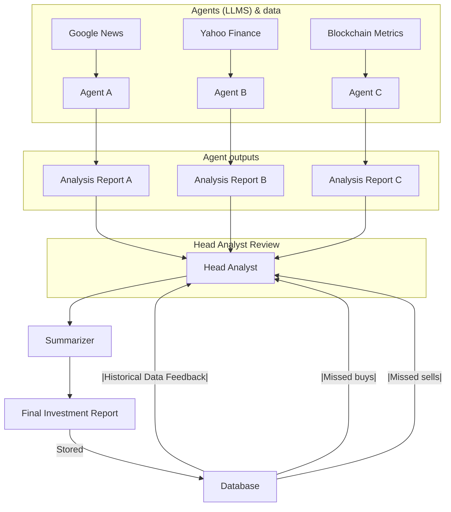

# MD&#967;

A crypto trading tool for Bitcoin that uses an AI-powered agents to provide investment recommendations (Buy, Sell, Hold).

## Vision
 Tackle tough challenges in a competitive field. Dream big, start small, learn fast, and throw all the AI against the wall to see what sticks.

## How MD&#967; works

## Data used

### yfinance data
- Crypto ticker symbols can be found [here](https://finance.yahoo.com/markets/crypto/all/?start=0&count=100)

### On-chain metrics

[Source](https://www.blockchain.com/explorer/api/blockchain_api)
- Hash Rate: Indicates the computational power used to mine Bitcoin. A rising hash rate suggests a secure and growing network.
- Mining Difficulty: Reflects how challenging it is to mine Bitcoin. It correlates with hash rate and can signal miner confidence.
- Active Addresses: Measures the number of active wallet addresses. Higher activity may indicate increased network usage.
- Transaction Volume: Total Bitcoin value transferred on-chain. It shows how actively Bitcoin is being transacted.

**To be included in the future:**
- Network Value to Transactions Ratio (NVT): Similar to a P/E ratio in stocks, it compares Bitcoin's market cap to its transaction volume.
- Realized Cap: Evaluates the market cap based on the price at which each Bitcoin was last moved. It helps identify over/undervaluation.

# Paper you should read (sorted by relevance)

[A Multimodal Foundation Agent for Financial Trading:
Tool-Augmented, Diversified, and Generalist](https://arxiv.org/abs/2402.18485)

[TradingAgents: Multi-Agents LLM Financial Trading Framework](https://arxiv.org/pdf/2412.20138)

[Can Large Language Models Beat Wall Street? Unveiling the Potential of AI in Stock
Selection](https://arxiv.org/abs/2401.03737)
